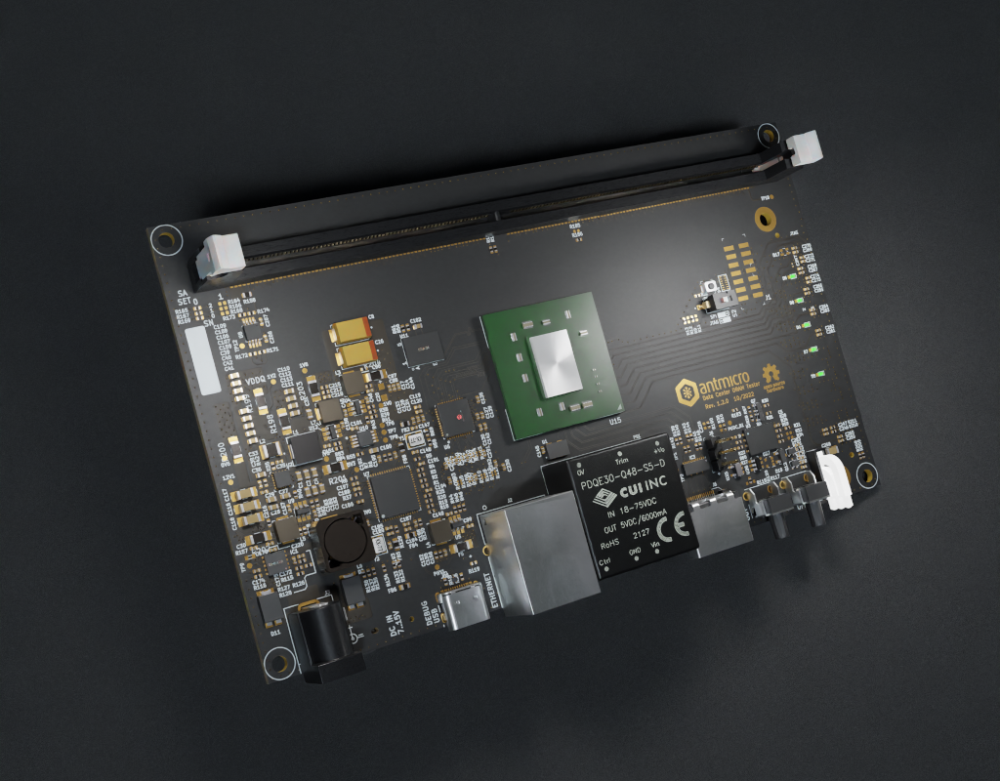

# Data Center DRAM Tester

Copyright (c) 2021-2022 [Antmicro](https://antmicro.com)

## Overview

This repository contains open hardware KiCad design files for an experimental platform built around the Xilinx Kintex-7 FPGA which can be used to interface with RDIMM DDR4 RAM modules used in data centers.

This hardware platform is used in Antmicro's and Google's [Rowhammer testing framework](https://github.com/antmicro/litex-rowhammer-tester) which can be used to perform (and potentially mitigate) Rowhammer attacks on DRAM memories. You can learn more about Rowhammer and our work towards mitigating it in a Google Open Source blog note [describing a related platform](https://opensource.googleblog.com/2021/11/Open%20source%20DDR%20controller%20framework%20for%20mitigating%20Rowhammer.html).
The usage instructions for this board are also provided in the [Rowhammer testing framework documentation](https://litex-rowhammer-tester.readthedocs.io/en/latest/). 

## Repository structure

The main repository directory contains KiCad PCB project files, a LICENSE and README.
The remaining files are stored in the following directories:

* `lib` - contains the component libraries
* `img` - contains graphics for this README

## Key Features

* Kintex-7 FPGA (XC7K160T-FFG676)
* DDR4 RDIMM connector
* HDMI output connector
* Ethernet RJ45 connector with 1GbE transciever
* Micro USB debug connector with FT4232HQ FTDI USB controller
* JTAG
* microSD card slot
* 16Mbytes S25FL128S QSPI FLASH memory
* S27KL0641 HyperRAM
* External 7-12V power input
* 5 user LEDs
* 4 user buttons

## License

[Apache-2.0](LICENSE)
